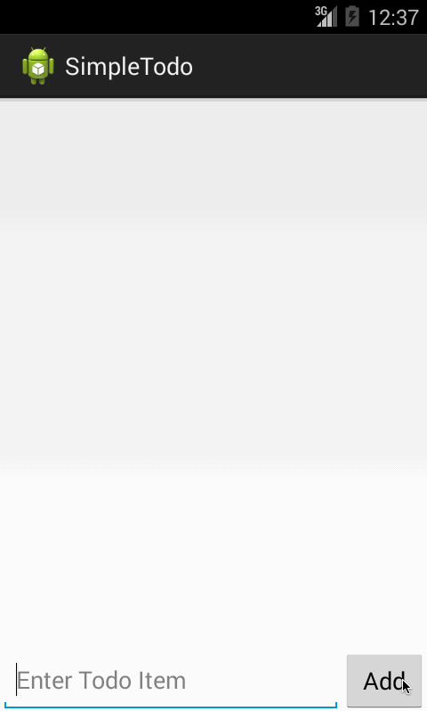

Simple Todo Demo

This is an Android demo application for managing a simple todo list, created followed the instruction.

Time spent: 4 hours spent in total

Completed user stories:

 * [x] Required: User can view a list of todo items
 * [x] Required: User can add a new todo items
 * [x] Required: User can remove a todo items by long click it
 * [x] Optional: Todo list will be read from a file & saved in the same one

Notes:

1 Spent sometime setup the Android

2 Trying to find a more user friendly solution for delete action. Expected behaviors like: swipe->show delete->then delete. 
  Not found a event to do this but get some ideas like using onTouchEvent to track the movement and then handler it.

Walkthrough of all user stories:

